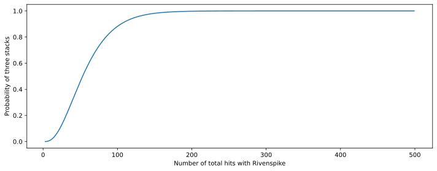
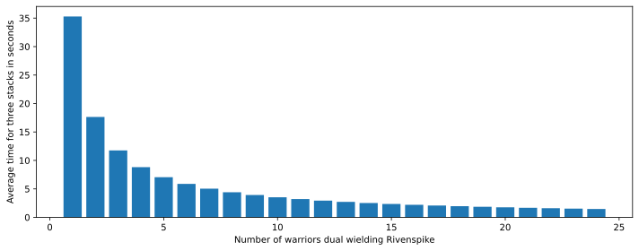
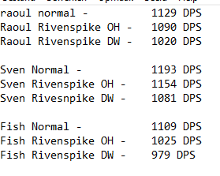

```python
import numpy as np
import scipy.special
import pandas as pd
import itertools
```


```python
import matplotlib.pyplot as plt
```

## Analysis of the buff and how fast you can get it up


```python
# Proc chance of Rivenspike is 4.93% ±0.66% according to Fight Club Discord
proc_chance = 0.05
```


```python
def probability_three_stacks_not_up(num_hits):
    num_procs = [0, 1, 2]
    probabilities = [scipy.special.binom(num_hits, num_proc)*(proc_chance**num_proc) * (1-proc_chance)**(num_hits-num_proc) for num_proc in num_procs]
    return sum(probabilities)
```


```python
total_hits = [i for i in range(3, 500)]
```


```python
probabilies_three_stacks = [1 - probability_not_up(hits) for hits in total_hits]
```


```python
# create a pandas dataframe for further analysis
df = pd.DataFrame({'hits': total_hits, 'probability': probabilies_three_stacks})
```


```python
# plot the graph
fig, ax = plt.subplots(figsize=(10, 4))
ax.plot(df['hits'], df['probability'])
ax.set_ylabel('Probability of three stacks')
ax.set_xlabel('Number of total hits with Rivenspike')
fig.tight_layout()
```





Lets calculate the minimum number of Rivenspike hits (assuming previous proc doesn't fall off) to get 3 stacks on boss with a probability of at least 95%


```python
num_hits_required_95_percent = df.loc[df['probability'] >= 0.95, 'hits'].iloc[0]
```


```python
num_hits_required_95_percent
```


    124


The average number of hits required for three stacks is, however, much lower and can also easily be calculated.
For that, we are first interested in the probabilty to get the third stack up on the n-th hit: <br /> <br />
$ P = {n-1 \choose 2}p^2(1-p)^{n-1-2}p$ <br /> <br />
where p is the proc chance and  n is the number of hits.


```python
def probability_third_stack_on_nth_hit(n):
    return scipy.special.binom(n-1, 2)*(proc_chance**2) * (1-proc_chance)**(n-3)*proc_chance
```


```python
Taking the expected value yields
```


```python
avg_num_hits_for_three_stacks = sum([n*foo(n) for n in range(3, 10000)])
avg_num_hits_for_three_stacks
```


    59.999999999999815


Intuitevly 60 hits makes sense since you also you would also need to roll a dice on average 6 times to get a six.

### How long does it take to apply 60 Rivenspike hits on the boss?
### Assumptions:
- Each Warrior has Windfury
- Full worldbuffs
- Conservative assumptions on gear (default gear on Steppenwolf spreadsheet)


```python
hits_per_sec_dual_wield = 1.70037
hits_per_sec_offhand = 0.4689
```


```python
num_warriors_with_rivenspike = range(1, 25)
```


```python
time_for_3_stacks_dw = [avg_num_hits_for_three_stacks/(num_warrior * hits_per_sec_dual_wield) for num_warrior in num_warriors_with_rivenspike]
time_for_3_stacks_dw
```


    [35.286437657686164,
     17.643218828843082,
     11.762145885895386,
     8.821609414421541,
     7.0572875315372325,
     5.881072942947693,
     5.040919665383737,
     4.410804707210771,
     3.9207152952984625,
     3.5286437657686163,
     3.2078579688805604,
     2.9405364714738464,
     2.7143413582835505,
     2.5204598326918686,
     2.3524291771790775,
     2.2054023536053853,
     2.0756728033933034,
     1.9603576476492313,
     1.8571809293519033,
     1.7643218828843081,
     1.6803065551279126,
     1.6039289844402802,
     1.534192941638529,
     1.4702682357369232]


```python
fig, ax = plt.subplots(figsize=(10, 4))
ax.bar(range(1,25), time_for_3_stacks_dw)
ax.set_ylabel('Average time for three stacks in seconds')
ax.set_xlabel('Number of warriors dual wielding Rivenspike')
fig.tight_layout()
```





```python
time_for_3_stacks_oh = [avg_num_hits_for_three_stacks/(num_warrior * hits_per_sec_offhand) for num_warrior in num_warriors_with_rivenspike]
time_for_3_stacks_oh
```


    [127.95905310300665,
     63.97952655150333,
     42.65301770100222,
     31.989763275751663,
     25.59181062060133,
     21.32650885050111,
     18.279864729000952,
     15.994881637875832,
     14.21767256700074,
     12.795905310300665,
     11.632641191182422,
     10.663254425250555,
     9.843004084846665,
     9.139932364500476,
     8.530603540200444,
     7.997440818937916,
     7.527003123706273,
     7.10883628350037,
     6.734687005421402,
     6.397952655150332,
     6.093288243000316,
     5.816320595591211,
     5.563437091435072,
     5.3316272126252775]


```python
fig, ax = plt.subplots(figsize=(10, 4))
ax.bar(range(1,25), time_for_3_stacks_oh)
ax.set_ylabel('Average time for three stacks in seconds')
ax.set_xlabel('Number of warriors using Rivenspike in offhand')
fig.tight_layout()
```


```python
# create also a function for the average time
def average_time_three_stacks(num_rs_dw, num_rs_oh):
    
    if num_rs_dw + num_rs_oh == 0:
        return np.inf
    return avg_num_hits_for_three_stacks/(num_rs_dw * hits_per_sec_dual_wield + num_rs_oh * hits_per_sec_offhand)
```

# So how worth it is it?
As shown in my discord post, once the armor debuff by three stacks is applied, all physical damage on Twin Emps will be increased by a stunning 8.87%! 
In order to determine if the dps gain outweighs the individual dps loss by equipping Rivenspike, let's have a look at some sim results provided by Fish: <br />
 <br />
According to this, let's assume the following dps losses while using Rivenspike:
- Dual Wielding: 9.5% DPS loss
- OH only: 3.4% DPS loss
<br />
<br />
<b>Further assumptions:</b>
<br />
<br />
- For simplicity, the dps gained from 1 or 2 stacks of Rivenspike is not taken into consideration
- One warrior dual wielding Rivenspike is enough to keep the buff up once three stacks are reached
- All other warriors will switch back to their normal weapons after three stacks are reached


```python
# total number of melees in the raid, change to adjust for a different raid composition
num_melees = 15
# fight length in seconds
fight_length = 300
dps_factor_dw = 0.905
dps_factor_oh = 0.966
# multiplicator once three stacks are up
dps_factor_debuff = 1.0887
```


```python
average_time_three_stacks(6, 2)
```


    5.3859867397006305


```python
# constant fight length is actually not 100% correct, as the dps increase would decrease the fight length
def net_dps(num_rs_dw, num_rs_oh, num_melees, fight_length):
    # num_rs_dw should always be bigger than 1, as that was the assumption
    if num_rs_dw < 1:
        return 1
    # start with calculation for time until stacks are up
    dps_before_debuff = (num_rs_dw * dps_factor_dw + num_rs_oh * dps_factor_oh + (num_melees - num_rs_dw - num_rs_oh) * 1)/num_melees
    # dps after debuff
    dps_after_debuff = ((1*dps_factor_dw + (num_melees-1)*1)*dps_factor_debuff)/num_melees
    # time until debuff is up
    time_to_debuff = average_time_three_stacks(num_rs_dw, num_rs_oh)
    # now calculate the total dps as a weighted average
    return (time_to_debuff * dps_before_debuff + (fight_length - time_to_debuff) * dps_after_debuff)/fight_length
```


```python
net_dps(1, 0, 15, 300)
```


    1.0714379524140822


So even only one warrior using double Rivenspike is already quite a substantial DPS gain of 7.14% for the whole raid. 


```python
# lets search for the optimal number of rivenspike users
def net_dps_grid(num_melees, fight_length):
    params = []
    for i in range(1, num_melees+1):
        for u in range(0, num_melees+1-i):
            params.append({
                'num_rs_dw': i,
                'num_rs_oh': u,
                'net_dps': net_dps(i, u, num_melees, fight_length)
            })
    return pd.DataFrame(params)
```


```python
net_dps_df = net_dps_grid(15, 300)
```


```python
best_setting = net_dps_df.loc[net_dps_df['net_dps'] == net_dps_df['net_dps'].max(), :]
```


```python
best_setting
```


<div>
<style scoped>
    .dataframe tbody tr th:only-of-type {
        vertical-align: middle;
    }

    .dataframe tbody tr th {
        vertical-align: top;
    }

    .dataframe thead th {
        text-align: right;
    }
</style>
<table border="1" class="dataframe">
  <thead>
    <tr style="text-align: right;">
      <th></th>
      <th>num_rs_dw</th>
      <th>num_rs_oh</th>
      <th>net_dps</th>
    </tr>
  </thead>
  <tbody>
    <tr>
      <th>119</th>
      <td>15</td>
      <td>0</td>
      <td>1.080418</td>
    </tr>
  </tbody>
</table>
</div>


This final result about the best setting indicates that the more warriors use Rivenspike in the beginning to get the stacks up, the better. The additional dps gain is, however, very minor (only about 0.9% dps).

## Conclusion
We saw, that one dual wielding Warrior using Rivenspike is already enough to increase the Raid DPS by over 7%! That's why I think it's definitely worth using from a theoretical perspective.
